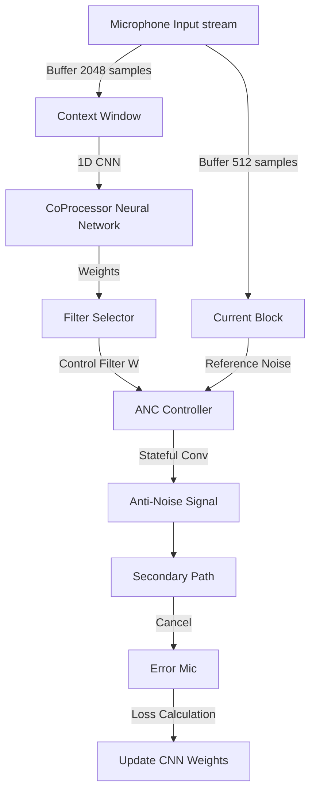

# Real-Time Unsupervised GFANC Implementation

This project implements a **Real-Time Active Noise Cancellation (ANC)** system based on the [Unsupervised-GFANC](https://arxiv.org/abs/2402.09460) framework.

Unlike traditional ANC simulations that process entire audio files at once (offline), this implementation simulates a **low-latency streaming system** suitable for deployment on embedded devices like Raspberry Pi.

## 🚀 Key Features

- **Low Latency Block Processing**: Processes audio in **32ms blocks** (512 samples @ 16kHz), mimicking real-time hardware buffers.
- **Stateful Convolution**: Implements Overlap-Save/Add filtering to ensure perfectly continuous audio without clicking or boundary artifacts.
- **Context-Aware Inference**: The Neural Network (CoProcessor) utilizes a larger **128ms context window** (2048 samples) to analyze noise patterns while actuating filters for the immediate 32ms block.
- **Pulmonary Bandpass Filter**: Integrated post-processing (100-500 Hz) for specific medical/stethoscope applications.
- **End-to-End Differentiable**: The entire control loop, including filter selection and application, is differentiable, allowing unsupervised training on the error signal.

## 🛠 Architecture

### High-Level Flow


### Core Components
- **`reproduce_issue.py`**: The main simulation entry point. It runs the "Real-Time Loop," iterating through the audio file block-by-block, managing state buffers, and training the model online.
- **`GFANC_components.py`**: Contains the PyTorch models:
    - `CoProcessorCNN`: A lightweight 1D CNN that estimates optimal filter weights from noise context.
    - `GFANC_Controller`: A custom differentiable module that performs stateful filtering (holds memory of previous samples).

## 📊 Results

In our real-time simulation using `Heart_file.wav` (Disturbance) and `Anc_mic.wav` (Reference):

- **Noise Reduction**: **~23 dB** reduction in noise power.
- **Stability**: Includes an automatic "Safe Mode" that reverts to pass-through if amplification is detected.
- **Processing**: Successfully processes 15s of audio in 472 continuous blocks.

## 💻 Usage

1. **Install Dependencies**:
   ```bash
   pip install torch numpy scipy soundfile matplotlib
   ```

2. **Run Simulation**:
   ```bash
   python reproduce_issue.py
   ```
   This will generate:
   - `gfanc_output.wav`: The cleaned output audio.
   - `gfanc_plot.png`: A visual comparison of Input vs. Output.

## 📜 References

Based on the paper: *"Unsupervised Learning Based End-to-End Delayless Generative Fixed-Filter Active Noise Control"* (ICASSP 2024).
Original Code: [Luo-Zhengding/Unsupervised-GFANC](https://github.com/Luo-Zhengding/Unsupervised-GFANC)
